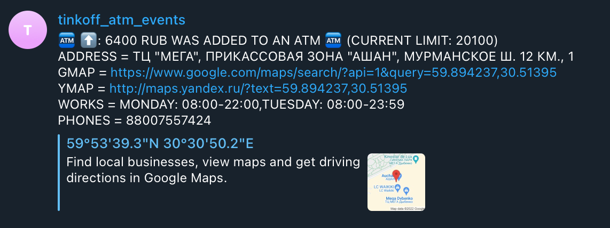

# tatms

tech-radar: scala, scalafmt, sbt, tagless final, http4s, fs2, circe, refined, pureconfig, cats, cats-effect, event-sourcing 

application creates stream of events coming from atms in various cities of russia, mimicking a basic event-sourcing pattern app. it polls data from a public tinkoff atm api (https://www.tinkoff.ru/maps/atm/), transforms internal state changes into events and sends them to a telegram chat via a provided telegram bot token.

only cities of russia with more than 1kk population are supported (https://en.wikipedia.org/wiki/List_of_cities_and_towns_in_Russia_by_population)

## required env vars: 
- TG_BOT_TOKEN (BotFather provides it after bot creation)
- CHAT_ID (chat or group it, can be acquired via a call of @JsonDumpBot, for example)

## restrictions
- telegram api does not allow more than ~30 messages per second
- tinkoff api does not allow polling via foreverM, so messages are polled within a configurable period 

## stranger atm things
tinkoff api maintains internal state in a very strange manner: after any operation is completed, next poll tells the opposite of the previous operation, next poll tells the compensating operation that was received firstly (+ 100, then -100, then +100 again). 

because of that it is really hard to distinguish whether 
- an atm was loaded, when it was empty
- funds were partially withdrawn from an atm and further funds can be withdrawn
- funds were added to an atm, when its limit was non-negative

longer polling intervals make the issue less visible, but it cannot be eliminated fully (you do not generally know which state change should be trusted - a negative or a positive one), so most of the incoming messages are left deduplicated. 

as this application was made only for illustration purposes, the above-mentioned issue can be neglected (though app's business logic is written to handle state changes correctly).

things that can be added to make this toy a living creature: 

- there might be a way to safely deduplicate messages to maintain state in a stricter manner. this might be blocked (and more likely _is_ blocked) by
1. the nature of the api itself (called by web and mobile clients and cached for time intervals much longer that a couple of minutes)
2. protective actions made by tinkoff themselves implemented per user and/or user agent.
- state managing `cats.effect.Ref` can be changed in favour of a persistent-first database (postgres, mongodb, cassandra)
- bot can receive commands to subscribe to a specific city, specific atm or specific currency of specific atm.
- application can send notifications per email or forward them in _some_ different way